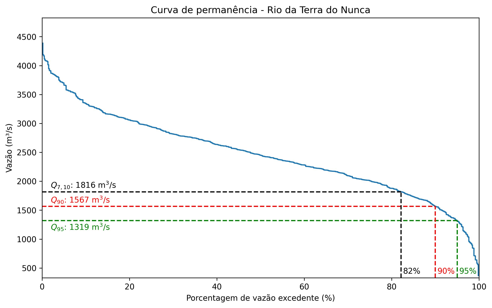

# Análise Hidrológica - Curva de Permanência e Valores $Q_{90}$, $Q_{95}$ e $Q_{7,10}$

Este é um projeto em Python para análise hidrológica, que calcula a curva de permanência e determina os valores de $Q_{90}$, $Q_{95}$ e $Q_{7,10}$ com base em uma série histórica de dados de vazão.

## Motivação e Objetivos

A gestão eficiente dos recursos hídricos é essencial para garantir o abastecimento sustentável de água em diversas atividades humanas. Nesse contexto, a análise hidrológica desempenha um papel fundamental na compreensão dos padrões de fluxo de água em uma bacia hidrográfica. Um dos aspectos-chave dessa análise é a determinação da curva de permanência e dos valores de $Q_{90}$, $Q_{95}$ e $Q_{7,10}$, que são indicadores cruciais para o planejamento e gerenciamento dos recursos hídricos.

## Como Usar

1. **Instalação das Dependências:**
   - Certifique-se de ter Python 3.x instalado em seu sistema.
   - Instale as dependências executando `pip install -r requirements.txt`.

2. **Execução do Código:**
   - Execute o arquivo `analise_hidrologica.py` em seu ambiente Python.

3. **Visualização dos Resultados:**
   - O código irá gerar um gráfico da curva de permanência, destacando os valores de $Q_{90}$, $Q_{95}$ e $Q_{7,10}$.

## Exemplo de resultado

